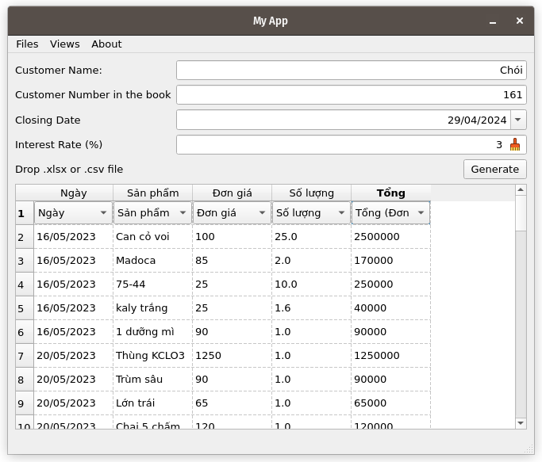
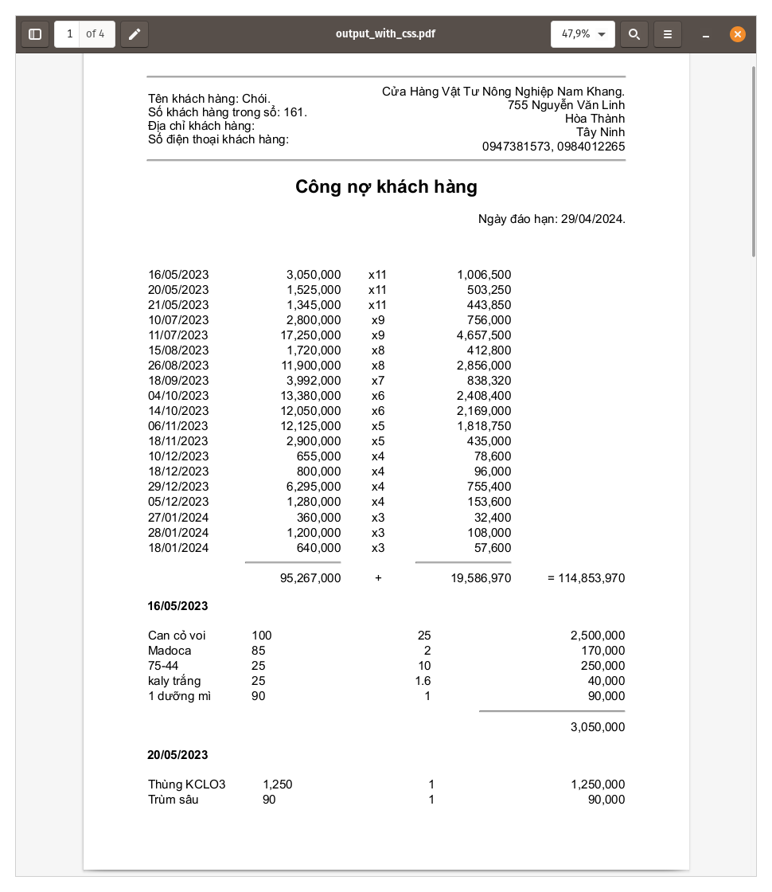
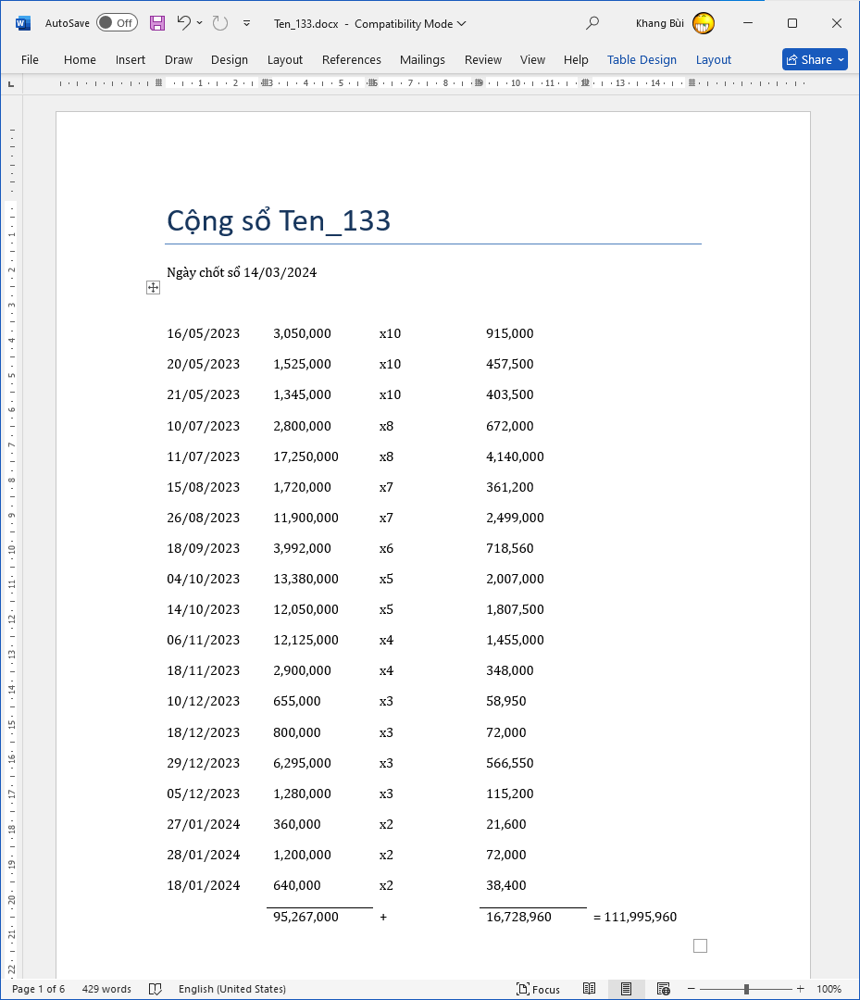

# Debt Calculation (Update 08/2024)


## PDF OUTPUT

## DOCX OUTPUT


# Installation
## Build from source
Python version: 3.10.16

Install from requirements:
`pip install -r requirements.txt`

Import requirements:
`pip freeze > requirements.txt`

## WINDOWS
``` bash
python -m venv env
```

If you have any problem with weasyprint missing library or something, try to install [GTK-for-Windows-Runtime-Environment-Installer](https://github.com/tschoonj/GTK-for-Windows-Runtime-Environment-Installer/releases)

## MACOS

## LINUX

Create env with pyenv

First, install the desire version of your python as given below

`pyenv install <version>`

Next, set the global version as given below:

`pyenv global <version>`

Finally, create the virtual environment as given below:

`pyenv exec python -m venv venv`
